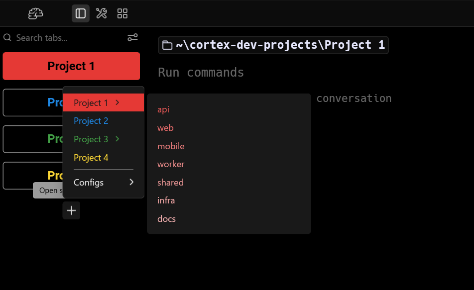

<p align="center">
  
</p>

Cortex is a personal fork of [Warp](https://github.com/warpdotdev/warp) — a customization and convenience layer for people who like Warp's terminal and IDE features but want fewer of its AI / Oz Agent bits.

## Tab appearance and agent-state animations


Cortex tabs visually reflect the state of the CLI agent running inside each session. Only Claude Code is supported for now.

## Custom Theme Library


Cortex bundles a large collection of terminal color schemes from four open-source community projects (Gogh, iTerm2-Color-Schemes, base16, terminal.sexy) into a searchable picker, with the option to star favorites. See [Credits](#credits) below.

## Saved projects



A persistent saved-projects list lives in the vertical tab sidebar. Add a project once, then open a new session into it from the "+" picker any time after. Projects can also declare sub-projects — useful for monorepos and config trees where you frequently bounce between related working directories.

## Cortex Settings panel

Every Cortex-exclusive feature is individually toggleable, so you can dial Cortex anywhere from "just upstream Warp" to "fully customized" without forking again. The toggles live in a dedicated settings pane (separate from Warp's own settings), grouped into sections.

## Installation

Cortex builds from source with Warp's existing build scripts.

**macOS / Linux**

```sh
./script/bootstrap     # one-time dependency setup
./script/run           # build and launch
```

**Windows (PowerShell)**

```powershell
.\script\windows\bootstrap.ps1              # one-time dependency setup
cargo run --bin warp-oss --features gui     # build and launch
```

That's the whole flow. See [`WARP.md`](WARP.md) for Warp's engineering guide, or [`CLAUDE.md`](CLAUDE.md) if you want to develop Cortex itself.

## Credits

- **[Warp](https://github.com/warpdotdev/warp)** — the terminal Cortex sits on top of. None of this exists without their work, and especially their decision to open-source the client. Cortex inherits Warp's license split (MIT for `warpui_core` and `warpui`, AGPL-3.0 for the rest).
- **Color themes** — bundled from four open-source community libraries:
  - [Gogh](https://github.com/Gogh-Co/Gogh) — ~361 schemes (MIT)
  - [iTerm2-Color-Schemes](https://github.com/mbadolato/iTerm2-Color-Schemes) — ~381 schemes (MIT; individual schemes retain their original copyright)
  - [base16](https://github.com/chriskempson/base16) — ~179 schemes (MIT)
  - [terminal.sexy](https://github.com/stayradiated/terminal.sexy) — ~157 schemes (MIT)

  Each theme's display name preserves its source tag (e.g. *"3024 (base16)"*, *"Adventure Time (Gogh)"*). The hand-curated default themes shipped with Warp are separate from this bundled library.

## License

Cortex inherits Warp's licensing. The `warpui_core` and `warpui` crates are [MIT](LICENSE-MIT); everything else is [AGPL-3.0](LICENSE-AGPL).

## Issues and contributions

Cortex doesn't ship with formal support, but I use it every day and I'm open to looking at issues or PRs that touch Cortex-specific code — no promises on response time. For bugs in upstream Warp behavior, file at [`warpdotdev/warp`](https://github.com/warpdotdev/warp/issues).
