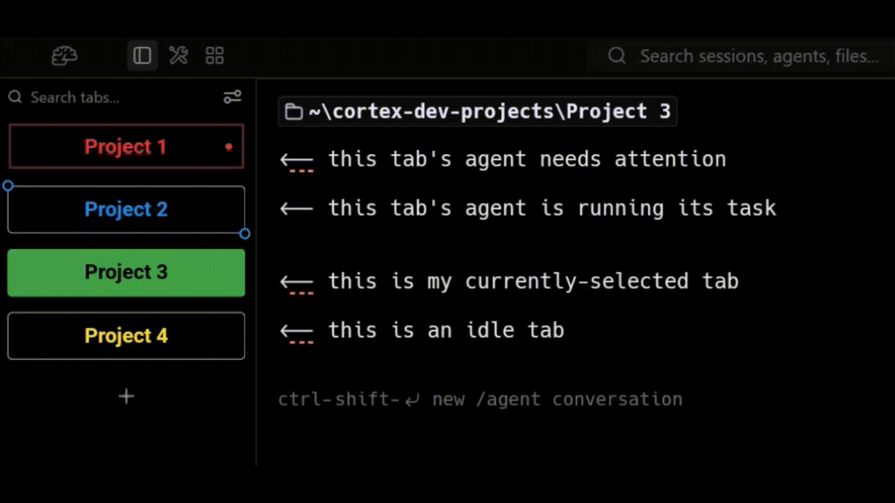
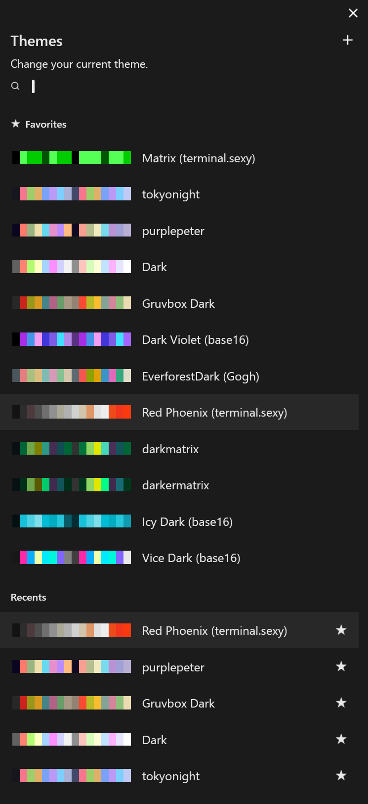

<p align="center">
  
</p>

> A personal fork of [Warp](https://github.com/warpdotdev/warp) by [@lawsmd](https://github.com/lawsmd) — a customization and convenience layer on top of the upstream terminal. Use at your own risk; this is built for me, not as a product.

Cortex is Warp with a different coat of paint and a handful of extra knobs. Almost all the work is still Warp's — Cortex is the layer on top, not a rewrite. If you want the real, supported terminal, grab [Warp](https://www.warp.dev). If you want my personal flavor of it, you're in the right place.

## Tab appearance and agent-state animations



Cortex tabs visually reflect the state of the CLI agent (Claude Code, Codex, etc.) running inside each session. Project tabs get a colored ring. An idle session sits still; a session whose agent is actively working has its border breathe; a session whose agent is waiting on you flashes a "needs attention" indicator with a pulsing dot. Glance at the sidebar and you can tell which sessions are busy, which are blocked, and which are idle without switching into them.

## Theme library (~1,079 themes)



Cortex bundles around 1,079 terminal color schemes drawn from four open-source community projects (Gogh, iTerm2-Color-Schemes, base16, terminal.sexy). They live in the theme picker, are searchable, and you can star favorites — your stars surface in a dedicated "Favorites" section at the top of the list. None of these themes are original work in this repository; full credit is in the Credits section below.

## Saved projects

<!-- TODO: screenshot of the "+" picker showing saved projects + sub-projects -->

A persistent saved-projects list lives in the vertical tab sidebar. Add a project once, then open a new session into it from the "+" picker any time after. Projects can also declare sub-projects — useful for monorepos and config trees where you frequently bounce between related working directories.

## Cortex Settings panel

Every Cortex-exclusive feature is individually toggleable, so you can dial Cortex anywhere from "just upstream Warp" to "fully customized" without forking again. The toggles live in a dedicated settings pane (separate from Warp's own settings), grouped into sections.

## Building it yourself

Cortex builds from source with Warp's existing build scripts.

**macOS / Linux**

```sh
./script/bootstrap     # one-time dependency setup
./script/run           # build and launch
```

**Windows (PowerShell)**

```powershell
.\script\windows\bootstrap.ps1              # one-time dependency setup
cargo run --bin warp-oss --features gui     # build and launch
```

That's the whole flow. See [`WARP.md`](WARP.md) for Warp's engineering guide, or [`CLAUDE.md`](CLAUDE.md) if you want to develop Cortex itself.

## Credits

- **[Warp](https://github.com/warpdotdev/warp)** — the terminal Cortex sits on top of. None of this exists without their work, and especially their decision to open-source the client. Cortex inherits Warp's license split (MIT for `warpui_core` and `warpui`, AGPL-3.0 for the rest).
- **Color themes** — bundled from four open-source community libraries:
  - [Gogh](https://github.com/Gogh-Co/Gogh) — ~361 schemes (MIT)
  - [iTerm2-Color-Schemes](https://github.com/mbadolato/iTerm2-Color-Schemes) — ~381 schemes (MIT; individual schemes retain their original copyright)
  - [base16](https://github.com/chriskempson/base16) — ~179 schemes (MIT)
  - [terminal.sexy](https://github.com/stayradiated/terminal.sexy) — ~157 schemes (MIT)

  Each theme's display name preserves its source tag (e.g. *"3024 (base16)"*, *"Adventure Time (Gogh)"*). The hand-curated default themes shipped with Warp are separate from this bundled library.

## License

Cortex inherits Warp's licensing. The `warpui_core` and `warpui` crates are [MIT](LICENSE-MIT); everything else is [AGPL-3.0](LICENSE-AGPL).

## Support

There isn't any. Cortex is a personal fork — I don't accept bug reports or PRs against it. If you find something broken upstream in Warp, file it on [`warpdotdev/warp`](https://github.com/warpdotdev/warp/issues).
